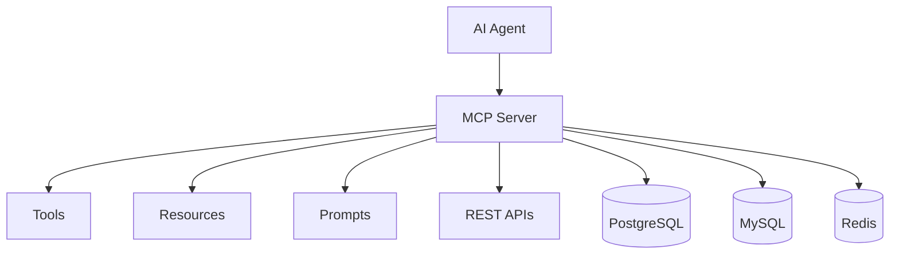

# MCP Server Starter Kit

Build production-ready MCP servers without starting from scratch.

Connect your APIs, databases, and internal tools to AI agents through the Model
Context Protocol (MCP).

## Why this exists

MCP standardizes how AI agents discover and call tools, read resources, and use
prompts. Most teams still start each server by repeating the same transport,
validation, authentication, logging, health check, and deployment work.

This kit provides a small, SDK-aligned TypeScript foundation so you can focus on
your domain. It intentionally does not hide the official
`@modelcontextprotocol/sdk` behind a large proprietary framework.

## Features

- Current MCP TypeScript SDK APIs (`registerTool`, `registerResource`, `registerPrompt`)
- Streamable HTTP and STDIO transports
- Typed Zod input validation
- Optional bearer API-key authentication
- Explicit, non-wildcard CORS configuration
- Structured logging with secret redaction
- Health, readiness, and graceful shutdown
- Safe PostgreSQL and MySQL table adapters with parameterized queries
- Namespaced Redis get/set/delete/list tools
- Generic REST integration with timeouts, retries, and response validation
- CLI for development, validation, diagnostics, and inspection
- Multi-stage Docker image and Compose stack
- Vitest, ESLint, Prettier, strict TypeScript, and GitHub Actions

## Architecture



```text
packages/
  core/             MCP wrapper, config validation, logging, errors
  server/           HTTP and STDIO transports, auth, health, readiness
  integrations/     PostgreSQL, MySQL, Redis, REST adapters
  cli/              mcp-server doctor/validate/inspect/dev commands
  create-mcp-server Standalone project generator
examples/
  basic/            Minimal tools
  rest-api/         Public REST API mapping
  postgres/         Safe parameterized database tools
  redis/            Namespaced cache tools
  complete/         Auth, PostgreSQL, Redis, REST, Docker
```

## Quick start

```bash
npm install
npm run build
npm run dev
```

The default endpoint is `http://127.0.0.1:3000/mcp`.

Validate the repository:

```bash
npm run lint
npm run typecheck
npm test
npm run build
```

## Create a new server

Once `create-mcp-server` is published:

```bash
npx create-mcp-server my-server
cd my-server
npm install
npm run dev
```

Or:

```bash
npm create mcp-server@latest my-server
```

From this repository before packages are published:

```bash
npm exec --workspace create-mcp-server -- create-mcp-server my-server --skip-install
cd my-server
npm install
npm run dev
```

The generated project includes strict TypeScript, tools, a resource, a prompt,
configuration, an `.env.example`, tests-ready scripts, and Docker.

## Define a tool

```ts
import { z } from "zod";

server.tool(
  "get_weather",
  {
    description: "Get current weather for a city",
    inputSchema: { city: z.string().min(1) },
  },
  async ({ city }) => {
    const weather = await getWeather(city);
    return { content: [{ type: "text", text: JSON.stringify(weather) }] };
  },
);
```

## Resources and prompts

```ts
server.resource(
  "getting-started",
  "docs://getting-started",
  { description: "Project documentation", mimeType: "text/markdown" },
  async () => ({
    contents: [{ uri: "docs://getting-started", text: "# Getting started" }],
  }),
);

server.prompt(
  "summarize",
  "Create a concise summary prompt",
  { topic: z.string() },
  async ({ topic }) => ({
    messages: [
      { role: "user", content: { type: "text", text: `Summarize ${topic}.` } },
    ],
  }),
);
```

## Integrations

### PostgreSQL and MySQL

Expose explicitly selected tables and columns:

```ts
registerPostgresTools(server, {
  pool,
  tables: [
    {
      name: "users",
      primaryKey: "id",
      columns: ["id", "name", "email"],
      searchColumns: ["name", "email"],
    },
  ],
});
```

The adapter generates list, get, and search tools. Every dynamic value is bound
as a query parameter. Identifiers are validated against a strict allowlist.
There is no arbitrary SQL tool.

### Redis

```ts
registerRedisTools(server, { client: redis, prefix: "my-server" });
```

Keys are automatically namespaced and wildcard key injection is rejected.

### REST APIs

```ts
const api = createHttpIntegration({
  baseUrl: process.env.API_URL,
  headers: { authorization: `Bearer ${process.env.API_TOKEN}` },
  retries: 1,
  timeoutMs: 8000,
});

api.mapToTools(server, [
  {
    name: "list_posts",
    description: "List posts",
    method: "GET",
    path: "/posts",
    responseSchema: z.array(z.object({ id: z.number(), title: z.string() })),
  },
]);
```

Path overrides are disabled by default. An MCP client cannot redirect an
operation to another endpoint on the upstream host. Set
`allowPathOverride: true` only when clients must select among explicitly
intended paths; overrides remain restricted to the configured `baseUrl`.
Use `allowedPathPrefixes` to constrain opt-in overrides to exact path prefixes.

Upstream credentials remain server-side and are never returned to the MCP client.

## Authentication

Set:

```env
MCP_AUTH_ENABLED=true
MCP_API_KEY=replace-with-a-long-random-value
CORS_ORIGINS=https://example.com
```

Clients send:

```http
Authorization: Bearer <token>
```

Authentication can be disabled only explicitly for local development. Health
and readiness endpoints remain unauthenticated so orchestrators can monitor the
process without receiving MCP capabilities.

Streamable HTTP sessions are bounded in both directions:

```env
MAX_SESSIONS=100
MAX_SESSIONS_PER_IP=10
```

`MAX_SESSIONS` protects overall process memory, while `MAX_SESSIONS_PER_IP`
prevents one client address from opening excessive concurrent sessions. Tune
these values for your deployment and reverse-proxy configuration.
Each HTTP session receives an isolated SDK server instance with the same
registered tools, resources, and prompts. The shared `Toolkit` broadcasts MCP
logging notifications and subscribed resource updates to active sessions.

## CLI

```bash
npx mcp-server validate
npx mcp-server doctor
npx mcp-server inspect http://127.0.0.1:3000/mcp
npx mcp-server inspect https://example.com/mcp --api-key <token>
npx mcp-server dev
npx mcp-server build
npx mcp-server start
```

`inspect` connects with an MCP client and lists actual protocol capabilities;
it does not parse source files or guess registrations.

## Docker

```bash
export MCP_API_KEY='a-long-random-local-key'
export POSTGRES_PASSWORD='a-url-safe-local-password'
docker compose up --build
```

Services:

- MCP server: `http://localhost:3000/mcp`
- Health: `http://localhost:3000/health`
- Readiness: `http://localhost:3000/ready`
- PostgreSQL: initialized with a sample `users` table
- Redis: persistent local volume

## Examples

- `examples/basic`: hello and calculate tools
- `examples/rest-api`: JSONPlaceholder REST mapping
- `examples/postgres`: safe user list/get/search tools
- `examples/redis`: namespaced cache tools
- `examples/complete`: auth, PostgreSQL, Redis, REST, readiness, Docker

Run an example:

```bash
npm run dev --workspace @mcp-starter/example-basic
```

## Client compatibility

The server implements the MCP Streamable HTTP and STDIO transports. Any
current MCP-compatible client that supports those transports can connect.
Client configuration names and schemas change frequently, so this repository
does not embed unverified client-specific snippets. Use the endpoint above with
HTTP clients or the generated command with STDIO clients, and consult your
client's current MCP documentation for its local configuration format.

## Security

Read [SECURITY.md](SECURITY.md) before exposing a server beyond localhost. In
particular, use least-privilege database users, never expose arbitrary SQL,
keep secrets outside Git, restrict CORS origins, and terminate TLS at a trusted
edge reverse proxy or load balancer.

## Contributing

See [CONTRIBUTING.md](CONTRIBUTING.md) for setup, architecture, test
requirements, and integration guidelines.

## License

MIT. See [LICENSE](LICENSE).
